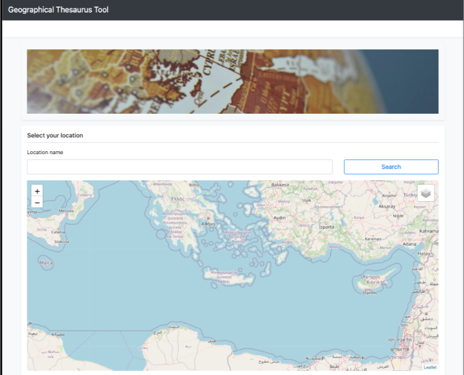
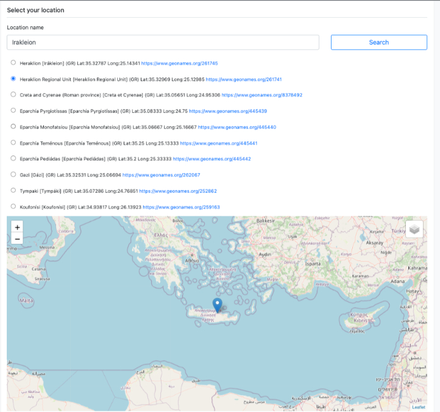

# Geographic Thesaurus Tool

**Geographic Thesaurus Tool** is a standalone web application that allows users to search for location names using the **[Geonames API](https://www.geonames.org/export/web-services.html)**, select from a list of possible matches, display them on an interactive map, get detailed information about the location and finally allows users to export the data as a **JSON file** for further use.

**Live Demo [here.](https://petrakis.info/GeographicThesaurusTool/)**

## Features

- **Search Locations**: Search for locations by name using the **Geonames API**.
- **Auto-Suggestions**: Provide a list of possible location matches for user selection.
- **Display on Map**: Show the selected location on an interactive map with multiple layers (e.g., terrain, satellite).
- **Detailed Location Info**: View detailed information about the selected location, such as geographical coordinates, country, population, etc.
- **Export Data**: Export the location details as a **JSON file**.

## Screenshots

#### Built With

* [jQuery](https://jquery.com/)
* [Bootstrap](https://getbootstrap.com/)
* [Leaflet](https://leafletjs.com/)
* [Geonames](https://www.geonames.org/v3/)

### Prerequisites

To run the **Geographic Thesaurus Tool** locally, you will need:

- A modern web browser (e.g., Chrome, Firefox, Edge)
- Optionally, a local web server to serve the files

### 2. Installation and deployment ###

Three simple steps: Clone - Deploy - Run.

1. Copy the project folder into the desired location. 

2. Deploy (drop the folder into your desired web appliction server (eg webapps for Apache Tomcat)).

3. Run 

### Configuration
API Key: You need to provide a Geonames API key in the app.js file. Replace the placeholder username (demo) with your own:

### Usage
- Search for a location: Enter a location name in the input field and click Search.
- Select from suggestions: The tool will display a list of possible locations. Select the desired location from the list.
- View the location: The selected location will be displayed on the map, along with additional information such as coordinates, id and name from Thesaurus.
- Export location data: Click the Export button to download a JSON file with detailed information about the selected location.

### License
This project is licensed under the MIT License - see the LICENSE file for details.

### Acknowledgements
- Geonames API
- Mapping libraries (Leaflet, Google Maps, etc.)
- JSON export functionality

### 3. Contact ### 

Kostas Petrakis < petrakis1@gmail.com >
